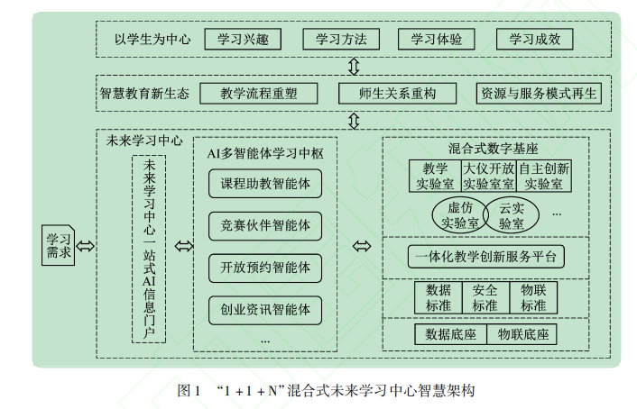
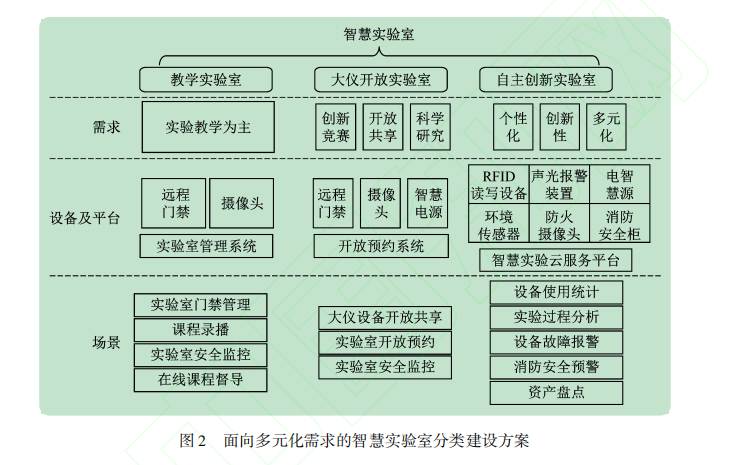
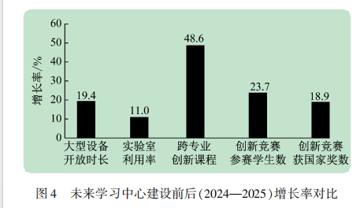

# 导读：基于AI大模型的高校混合式未来学习中心建设与实践

## 1. 研究背景

随着人工智能技术的迅猛发展，高等教育正经历着深刻的数字化转型。然而，当前高校实验教学普遍面临三大核心困境：一是**设备资源分散**，缺乏统一调度与管理，导致利用率低下；二是**教学模式单一**，线上线下割裂，难以支撑个性化与探究性学习；三是**管理适应性不足**，传统实验室管理系统无法应对跨学科、开放共享的复杂需求。

为解决上述问题，该文提出以**“1+1+N”智慧架构**为核心的未来学习中心建设范式，旨在通过AI大模型与混合式教学深度融合，构建一个以学生为中心、覆盖“教—学—练—研—创”全过程的智慧教育新生态。

## 2. 核心架构：“1+1+N”混合式未来学习中心

> [cite_start]**图注**：图 1 展示了论文提出的“1+1+N”智慧架构，通过 AI 大模型门户与智能体集群中枢（GPA），实现了教学资源与服务的智慧化调度 [cite: 8, 54, 77]。

文章的核心创新在于构建了**“1+1+N”三层智慧架构**，实现了线上资源与线下空间的有机协同，具体如下：

- **第一个“1”：一站式AI信息门户（感知层）**  
  作为师生统一入口，集成各类学习需求入口。学生可通过门户提出问题（如“我需要学哪些课程？”“谁能指导我？”），系统智能匹配资源，实现“所想即所得”的服务体验。

- **第二个“1”：AI多智能体学习中枢（核心层）**  
  这是整个架构的“智慧大脑”，由多个专业智能体集群组成，包括：
  - **开放预约智能体**：统筹实验室与大仪设备调度；
  - **课程助教智能体**：提供个性化学习路径推荐与答疑；
  - **竞赛伙伴与创业资讯智能体**：支持创新实践全过程。
  该中枢通过大语言模型驱动，实现自主学习和自适应反馈，支撑起“线上高效获取知识—线下便捷实践验证”的教学闭环。

- **“N”：混合式数字基座（支撑层）**  
  包含物理空间（智慧实验室、大仪开放实验室等）与数字空间（虚拟仿真、物联网标准、数据标准）。通过统一标准与数据互通，确保各类型实验室（教学、创新、大仪共享）在统一平台上实现**开放预约、安全监控、设备统计、过程分析**等一体化管理。

> [cite_start]**图注**：图 2 详细描绘了面向教学、大仪开放及自主创新三类不同需求的智慧实验室建设方案，实现了物理空间与信息空间的有机融合 [cite: 90, 110]。
该架构的核心在于通过智能体集群重塑教学流程、重构师生关系、再生资源服务模式，最终形成“需求—学习—实践—反馈”的智慧教育新生态。

## 3. 实验成效

哈尔滨工业大学（深圳）的实践应用证明了该模式的有效性与可推广性。根据文中图4及3.3节的数据，未来学习中心建设（2024—2025年）取得了显著量化成效：

- **跨学科课程建设**：一体化平台推动**跨专业创新课程开课率提升48.6%**，为复合型人才培养提供了有力支撑。
- **资源利用率提升**：大型设备开放时长增长19.4%，实验室整体利用率提高11%，智慧化管理机制有效解决了资源闲置问题。
- **创新能力增强**：依托中心支持的创新竞赛，参赛学生人数增长23.7%，获得国家级奖项数量提升18.9%，实现了“以赛促学、以创育人”的目标。

此外，AI赋能的混合式教学显著提升了学生完成复杂实验任务的正确率，充分验证了该模式在提升学习成效方面的巨大潜力。

> [cite_start]**图注**：图 3 的量化数据显示，未来学习中心建设后，跨专业创新课程开课率显著提升了 48.6%，大型设备开放时长增长了 19.4% [cite: 165, 211]。
## 4. 个人小结

该文提出的“1+1+N”混合式未来学习中心，不仅是技术层面的集成创新，更是对高校实验教学模式的一次系统性重构。其亮点在于：

1. **以学习者为中心**：从学生的真实问题出发，通过AI智能体提供全周期的个性化支持，真正实现了“因材施教”。
2. **数据驱动管理**：通过混合式数字基座打通“人—设备—空间—数据”的壁垒，为实验室精细化管理与科学决策提供了可能。
3. **开放与共享**：通过分类建设智慧实验室（教学、大仪开放、自主创新），有效平衡了“教学保障”与“开放共享”的矛盾，为跨学科创新提供了肥沃土壤。

总体而言，该建设模式为高校构建智慧教育生态提供了一条清晰、可操作的数字化转型路径。未来，随着大模型能力的持续演进，如何进一步优化智能体的协作机制、保障数据安全与伦理，将是值得深入探索的方向。

--- 

**关键词**：未来学习中心；大语言模型；实验教学数字化；混合式实验教学；教育智能体
```
